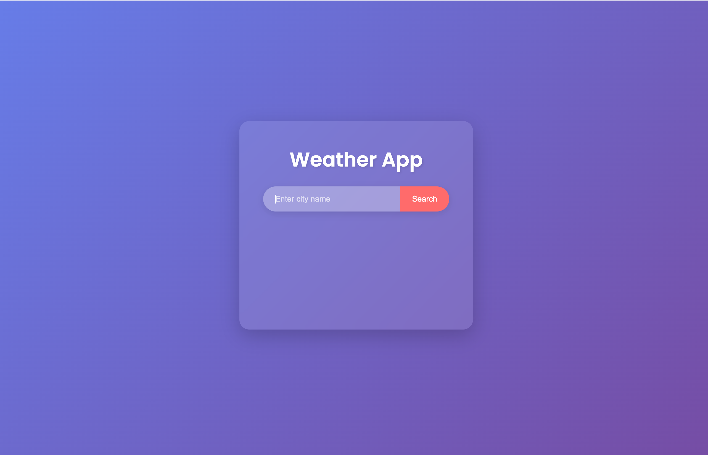
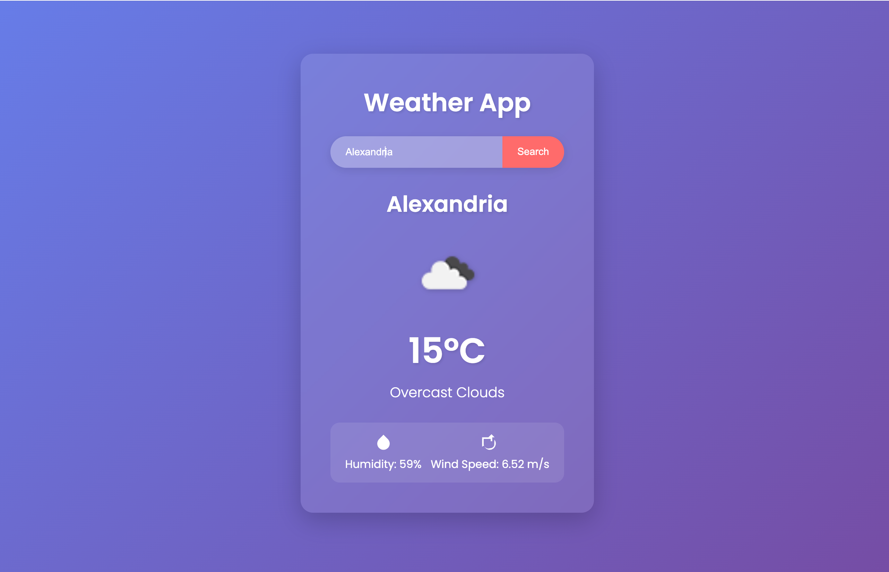
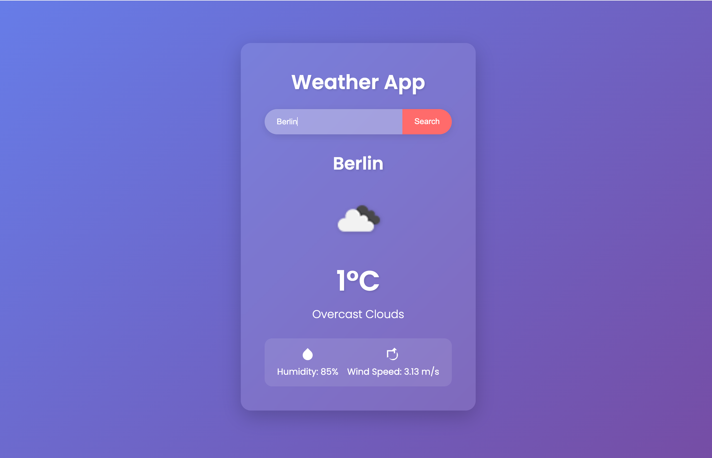

# 🌦️ WeatherVision - Real-Time Weather Forecast

**WeatherVision** is an elegant and easy-to-use web application that shows the current weather in any city around the world. Get up-to-date data on temperature, humidity, wind speed, and other parameters using the OpenWeather API.

## 🚀 Features
- 🌍 **Global Forecast**: Check the weather for any city.
- ☀️ **Current Temperature and Weather**: Shows the current temperature, weather description, and key parameters.
- 🌬 **Wind and Humidity Data**: Get wind speed and humidity level.
- 🎨 **Modern Interface**: Elegant and user-friendly interface with a minimalist design.
- 🌙 **Dark Mode**: Smooth transition between light and dark themes for nighttime users.

## 🛠 Technologies
- **HTML** – The structure of the app
- **CSS** – Stylish design with a responsive layout
- **JavaScript** – Application logic, API requests handling
- **OpenWeather API** – Weather data source

## 📸 Screenshots
  
  
  
*Real-time weather forecast for the city.*

## 🔥 Demo

You can try the application in action by following this https://yogurtt77.github.io/WeatherApp/

